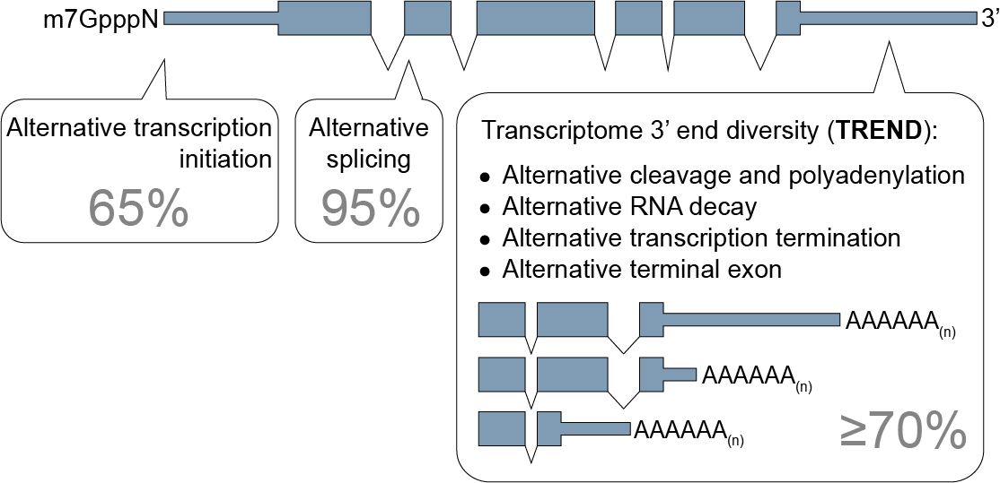

# **TREND-DB** database 

      

### *Explore interactively Transcriptome 3'end diversification (TREND)*

The diversity and dynamics of the transcriptome are important means for development and adaptation. 
Apart from alternative transcription initiation and alternative splicing, the diversification of the transcriptome 3'end is essential for expansion of transcriptome complexity.
This is predominantly achieved through a process referred to as *alternative polyadenylation (APA)*.
APA has likely critical functions in many processes by – as yet largely – unknown mechanisms (<a href="http://doi.org/10.1007/s00424-016-1828-3" target="_blank">Ogorodnikov et al. Pflugers Arch. 2016</a>).

In a recent large scale RNAi screening (Ogorodnikov et al. 2018), published on <a href="https://www.nature.com/articles/s41467-018-07580-5"  target="_blank">Nature Communications</a> (preprint on <a href="https://www.biorxiv.org/content/early/2018/10/18/426536" target="_blank">biorXiv</a>),  we identified PCF11 as a critical regulator of transcriptome-3'end-diversification, and how this connects alternative polyadenylation (APA) to formation and spontaneous regression of neuroblastoma.

This work contains a number of TREND-seq datasets investigating transcriptome-wide APA, covering >170 RNAis conditions. 
To facilitate the access for a broader scientific community, we created the TREND-DB application.

  

### TREND-DB

**TREND-DB** is a database that visualizes the **dynamics of alternative polyadenylation (APA)** influenced by various co- and post-transcriptional events.

**TREND-DB** allows to interactively explore the dynamic landscape of APA events caused by siRNA mediated downregulation of 174 APA-regulators (targeting various facets of transcriptional, co- and posttranscriptional gene regulation, epigenetic modifications and other categories) in Neuroblastoma BE(2)-C cells. Further entities are in progress.

The database facilitates:

- querying genes affected by specific APA-regulators
- querying APA-regulators affecting specific genes (with a graphical illustration of global genome-wide APA-effects)
- GO (Gene Ontology) enrichment of APA-affected genes
- visualization of APA-effects on internal gene visualization tools and on UCSC Genome Browser
- visualization of additional layers of gene regulation accounting for individual APA-affected target RNAs (*i.e.* miRNA binding sites) 

<!-- Link to technical How-To page (under construction) [][][]? --> 

### News

- **December 2018** - The PCF11 paper is out on <a href="https://www.nature.com/articles/s41467-018-07580-5"  target="_blank">Nature Communications</a> and has been chosen as <a href="https://www.nature.com/collections/bhkhbxstgj" target="_blank">Editor Highlight</a>!
- **October 2018** - The paper about PCF11 as critical regulator of transcriptome-3'end-diversification is out on [biorXiv](https://www.biorxiv.org)! You can read it <a href="https://www.biorxiv.org/content/early/2018/10/18/426536" target="_blank">here</a>

### Citations

- **Transcriptome 3′end organization by PCF11 links alternative polyadenylation to formation and neuronal differentiation of neuroblastoma**
  *Anton Ogorodnikov, Michal Levin, Surendra Tattikota, Sergey Tokalov, Mainul Hoque, Denise Scherzinger, Federico Marini, Ansgar Poetsch, Harald Binder, Stephan Macher-Göppinger, Hans Christian Probst, Bin Tian, Michael Schaefer, Karl J. Lackner, Frank Westermann & Sven Danckwardt*.
  Nature Communicationsvolume 9, Article number: 5331 (2018); doi: https://doi.org/10.1038/s41467-018-07580-5
- **PCF11 connects alternative polyadenylation to formation and spontaneous regression of neuroblastoma**
  *Anton Ogorodnikov, Michal Levin, Surendra Tattikota, Sergey Tokalov, Mainul Hoque, Denise Scherzinger, Federico Marini, Ansgar Poetsch, Harald Binder, Stephan Macher-Goeppinger, Bin Tian, Michael Schaefer, Karl Lackner, Frank Westermann, Sven Danckwardt*. 
  bioRxiv 426536; doi: https://doi.org/10.1101/426536
- **Processing and transcriptome expansion at the mRNA 3′ end in health and disease: finding the right end**
  *Ogorodnikov, A., Kargapolova, Y. & Danckwardt, S.*. Pflugers Arch - Eur J Physiol (2016) 468: 993.
  https://doi.org/10.1007/s00424-016-1828-3

### Responsible groups  

- Danckwardt Lab @ University Medical Center Mainz (<a href="https://www.unimedizin-mainz.de/cth/professuren-arbeitsgruppen/prof-danckwardt.html" target="_blank">link</a>) 
- IMBEI - Division Biostatistics and Bioinformatics @ University Medical Center Mainz (<a href="http://www.unimedizin-mainz.de/imbei/biostatistics-bioinformatics/welcome.html?L=1" target="_blank">link</a>) 

### How to use **TREND-DB**

*Section currently under construction*.

Soon to be deployed via `rintrojs` tours!

For the time being, please refer to the content of the **About** tab.

### Further reading

- <a href="https://www.nature.com/articles/s41467-018-07580-5" target="_blank">Ogorodnikov et al. 2018</a>
- <a href="http://doi.org/10.1007/s00424-016-1828-3" target="_blank">Ogorodnikov et al. Pflugers Arch. 2016</a>
- <a href="http://doi.org/10.1038/nrm.2016.116" target="_blank">Tian & Manley Nat Rev Mol Cell Biol 2016</a> 
- <a href="http://doi.org/10.1038/nrg3482" target="_blank">Elkon et al. Nat Rev Genet 2013</a>

