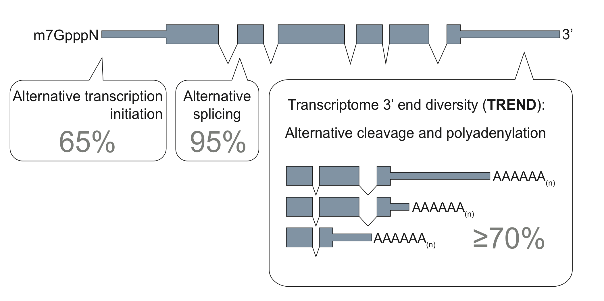

# **TREND-DB** database 

      

### *Explore interactively Transcriptome 3'end diversification (TREND)*

The diversity and dynamics of the transcriptome are important means for development and adaptation. 
Apart from alternative transcription initiation and alternative splicing, the diversification of the transcriptome 3'end is essential for expansion of transcriptome complexity.
This is predominantly achieved through a process referred to as *alternative polyadenylation (APA)*.
APA has likely critical functions in many processes by – as yet largely – unknown mechanisms (<a href="http://doi.org/10.1007/s00424-016-1828-3" target="_blank">Ogorodnikov et al. Pflugers Arch. 2016</a>).

In a recent large scale RNAi screening (Ogorodnikov et al. 2018), published on <a href="https://www.nature.com/articles/s41467-018-07580-5"  target="_blank">Nature Communications</a> (preprint on <a href="https://www.biorxiv.org/content/early/2018/10/18/426536" target="_blank">biorXiv</a>),  we identified PCF11 as a critical regulator of transcriptome-3'end-diversification, and how this connects alternative polyadenylation (APA) to formation and spontaneous regression of neuroblastoma.

This work contains a number of TREND-seq datasets investigating transcriptome-wide APA, covering >170 RNAis conditions. 
To facilitate the access for a broader scientific community, we created the TREND-DB application.
