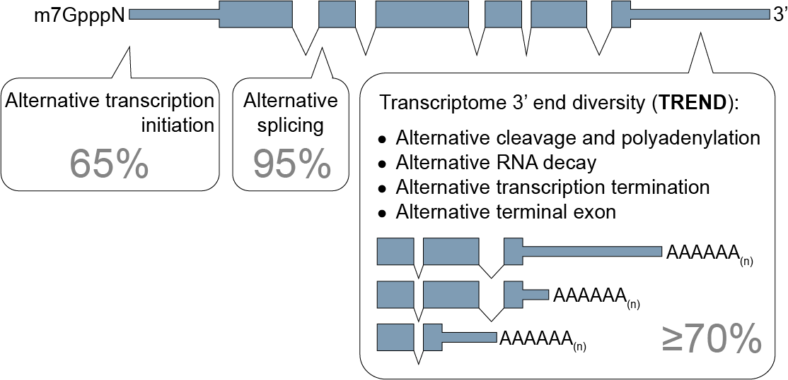

# **TREND-DB** database 

      

### *Explore interactively Transcriptome 3'end diversification (TREND)*

The diversity and dynamics of the transcriptome are important means for development and adaptation. 
Apart from alternative transcription initiation and alternative splicing, the diversification of the transcriptome 3'end is essential for expansion of transcriptome complexity, with likely critical functions in many processes by – as yet largely – unknown mechanisms (<a href="http://doi.org/10.1007/s00424-016-1828-3" target="_blank">Ogorodnikov et al. Pflugers Arch. 2016</a>).

In a recent work (Ogorodnikov et al. 2018) we recently published on <a href="https://www.nature.com/articles/s41467-018-07580-5"  target="_blank">Nature Communications</a> (preprint on <a href="https://www.biorxiv.org/content/early/2018/10/18/426536" target="_blank">biorXiv</a>),  we were able to show how PCF11 is a critical regulator of transcriptome-3'end-diversification, and connects alternative polyadenylation to formation and spontaneous regression of neuroblastoma.

This work contains a number of TREND-seq datasets investigating transcriptome-wide APA, covering >170 RNAis conditions. 
To facilitate access to that for the scientific community, we created the TREND-DB application, with the support of the colleagues from the IMBEI (development by Denise Scherzinger, [Federico Marini](https://federicomarini.github.io), Harald Binder).
